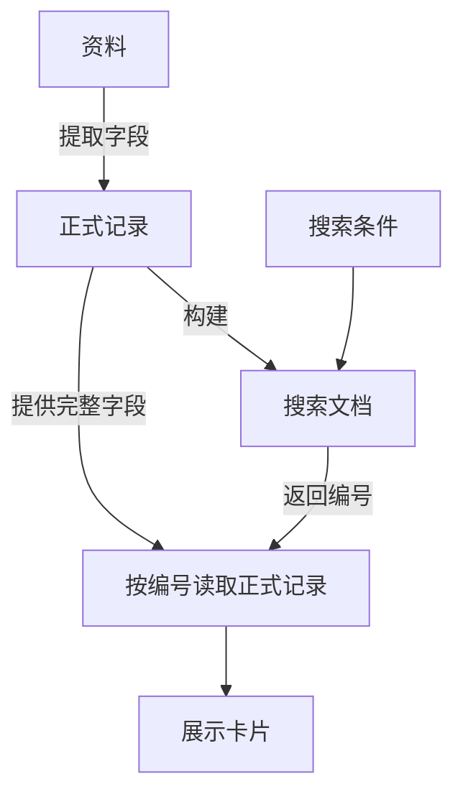

# 外部 Agent 与PaperMind交付协议

目标：用户在 Codex / 其他 Agent 中学习和生成文章，PaperMind承载阅读、批注与原文讨论。无需把写作对话迁进PaperMind。

## 告诉外部 Agent 的使用方式

> 请把学习笔记保存为 Markdown，再交付到本机PaperMind。首次使用 `papermind notes import 文件.md`。后续修改同一篇前，先用 `papermind notes get 文档ID` 读取最新正文、讨论和 revision，综合最新内容修改，再带 `--id` 和 `--revision` 交付。不要只改旧文件后覆盖PaperMind的新内容。最后给我返回的文档链接。若发生版本冲突，重新读取最新文档并合并，不要强行覆盖。

若没有安装 `papermind` 快捷命令，在本项目用 `node bin/papermind.mjs` 代替 `papermind`。后台服务需先启动：`papermind --background --no-open`。

## 命令

```sh
# 创建；文件绝对路径默认作为交付标识，重试同一份内容不重复创建
papermind notes import ./检索学习笔记.md

# 查找或读取；get 返回包含正文结构、讨论和 revision 的 JSON
papermind notes list
papermind notes get 文档ID

# 更新；revision 必须是刚刚读取的版本
papermind notes import ./检索学习笔记.md --id 文档ID --revision 3

# HTML 或标准输入；跨目录交付可使用稳定 key
papermind notes import ./文章.html --format html --title "学习笔记"
cat ./文章.md | papermind notes import - --key learning/retrieval
```

这里的“文档ID”是返回的 UUID，不是文章标题。命令输出包括 id、revision、是否新建、定位变化提示和可打开的 URL。默认连接 `127.0.0.1:4317`，可追加 `--port`。

## 正文关系图（0.5.0 起）

在 Markdown 中写 `mermaid` 围栏代码块，使用 `flowchart TD` / `flowchart LR` 或 `graph`。导入后阅读页直接渲染图，源码收在“编辑图稿”；支持适应宽度与原始大小切换。图与段落保存在同一份文档中，图旁文字仍可选中讨论。讨论回复中的同类 Mermaid 图也会渲染。

````markdown

````

当前支持流程与关系图，不支持其他 Mermaid 图类型。每图最多 20,000 字符、200 条边，每篇最多 20 张。不能包含配置指令、HTML 标签、点击操作或外部资源。图在本机绘制，无需上传图片到公网；普通语言代码块仍显示为代码。

导入返回 `diagrams: {count, syntax, display}`。`count > 0` 且 `syntax: "valid"` 表示图稿通过校验，`display: "pending_browser"` 表示页面显示尚未核验；无图时是 `count: 0` 和 `"none"`。**图稿校验成功不等于已看见图**：Agent 应打开返回的阅读 URL，检查图中节点、连线、文字与正文一致，并刷新确认。语法或格式错误会拒绝导入，原文不会被覆盖；页面渲染失败显示明确错误，不静默冒充普通代码。

图过宽或过长时应拆图、缩短标签，不能缩到无法阅读。需要整体关系图的任务不能用表格代替图来绕过错误。

图稿随 `document.json` 和 `README.md` 同步；新设备需要同样支持关系图的 PaperMind 版本。拉取时校验图稿，失败不覆盖本机。运行版本查看 `/api/health`；拉代码后需 `npm ci`、`npm run build` 并重启原服务，沿用原端口和数据目录，才能使用新功能。0.4.0 的运行进程不会随 git pull 自动获得渲染能力。

## 一致性

- 修改已有文档必须提供 revision；旧版本会被拒绝。
- 同一 key 的同一份原始交付内容重试时，返回已有文档，不回退用户在PaperMind的后续编辑。
- 对仍然唯一出现的相同原文，重新定位讨论及高亮；原文消失或出现多次时不猜测位置。讨论保留并标记原文已变化。
- 浏览器在没有本机未保存编辑、没有 AI 操作进行时，每 3 秒检查外部更新。后台标签重新聚焦也检查。未保存的输入不会被外部更新直接替换。
- 全文交付使用 Markdown 或 HTML；标题、列表、表格和代码块由解析器转换，HTML 经现有清理器处理。
- 通过本机 HTTP 服务写入；不要直接编辑 SQLite，也不要读取模型授权文件。

HTTP 接口：`POST /api/agent/documents`，字段为 body、format、title?、id?、revision?、key?。同样使用本机 session token；CLI 会自行取得并仅用于本机请求，不输出 token。
